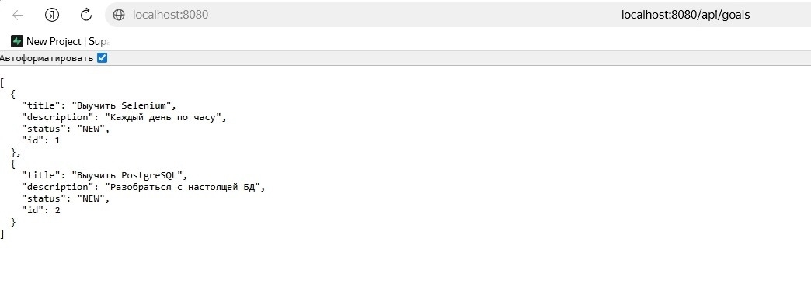
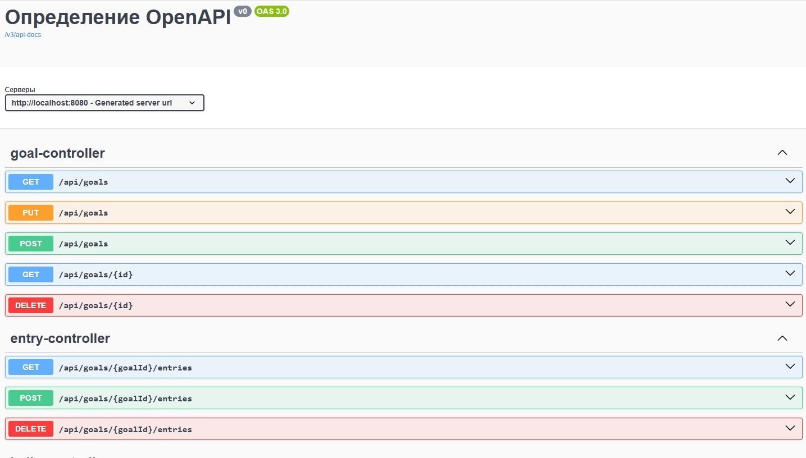
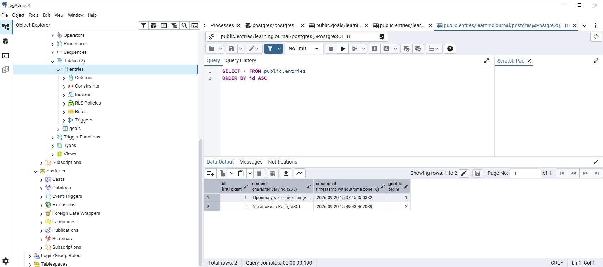
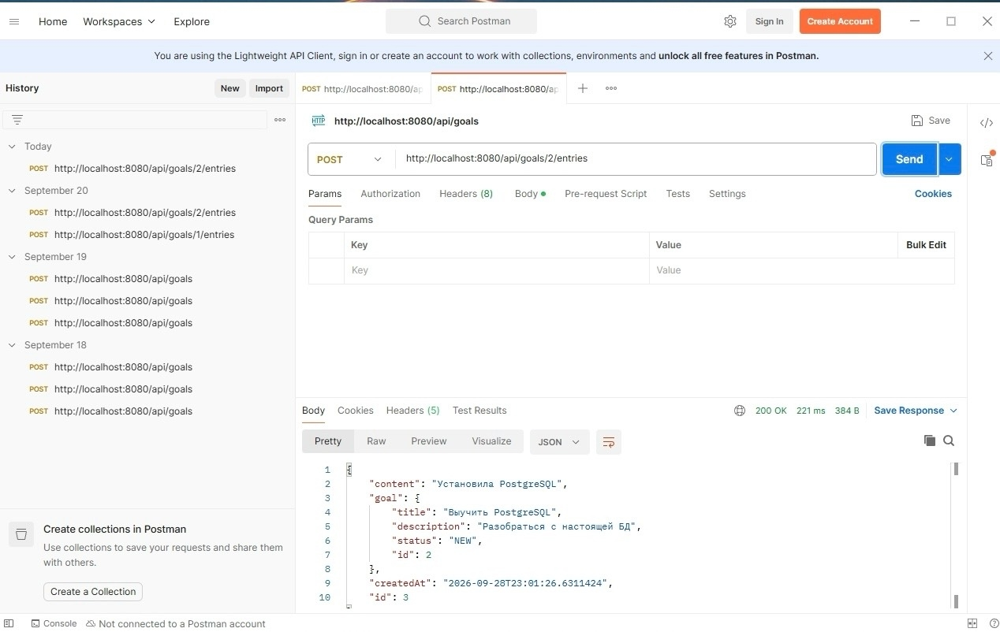

# Learning Journal
Учебный проект на Spring Boot — REST API для отслеживания личных целей и заметок об обучении.
## О проекте

Приложение для отслеживания  целей и заметок об обучении. Позволяет ставить цели, разбивать их на подцели и вести записи о прогрессе.

## Технологии

- Java 21
- Spring Boot 4.1.1
- Spring Data JPA (Hibernate)
- PostgreSQL 18
- Maven
- Git / GitHub
- JUnit 5 + Mockito (тестирование)
- Swagger / OpenAPI (документация API)

## Что уже готово

- REST API с полным CRUD для целей (Goal)
- REST API для записей к целям (Entry)
- Связь One-to-Many между Goal и Entry
- JPA-сущности с полями: id, title, description, status
- Подключение к базе данных PostgreSQL 18
- Автоматическое создание таблиц через Hibernate
- Слоистая архитектура: controller, service, repository, model
- Unit-тесты для сервисного слоя (JUnit 5 + Mockito)
- Документация API через Swagger UI
- Покрытие тестами: GoalService (4 теста)

## Стек и архитектура

Controller → Service → Repository → PostgreSQL

- **Controller** — принимает HTTP-запросы
- **Service** — бизнес-логика
- **Repository** — работа с БД через JPA
- **Model** — JPA-сущности

## REST API

### Цели (Goals)

| Метод | URL | Описание |
|-------|-----|----------|
| GET | `/api/goals` | Получить все цели |
| GET | `/api/goals/{id}` | Получить цель по ID |
| POST | `/api/goals` | Создать цель |
| PUT | `/api/goals/{id}` | Обновить цель |
| DELETE | `/api/goals/{id}` | Удалить цель |

### Записи (Entries)

| Метод | URL | Описание |
|-------|-----|----------|
| GET | `/api/goals/{goalId}/entries` | Получить записи цели |
| POST | `/api/goals/{goalId}/entries` | Создать запись |
| DELETE | `/api/goals/{goalId}/entries/{id}` | Удалить запись |

## Как запустить

1. Склонировать репозиторий:

   ```bash
   git clone https://github.com/ENS21/learningjournal.git

2. Открыть проект в IntelliJ IDEA
3. Установить PostgreSQL 18
4. Создать базу данных learningjournal через pgAdmin
5. Настроить подключение в src/main/resources/application.properties
6. Запустить LearningJournalApplication.java
7. Открыть в браузере: http://localhost:8080/api/goals — список целей   

## Swagger UI

Автоматическая документация API доступна по ссылке:

http://localhost:8080/swagger-ui/index.html
## Скриншоты

### REST API — ответ сервера



### Swagger UI — документация API



### PostgreSQL — таблицы с данными



### Postman — создание записи



## Планы
- [x] Добавить сущность Goal
- [x] Добавить сущность Entry
- [x] Подключить базу данных (PostgreSQL)
- [x] REST API для целей и записей
- [ ] Дерево подцелей
- [ ] Автотесты Selenium

## Автор

Екатерина Соколова — начинающий Java-разработчик
  
